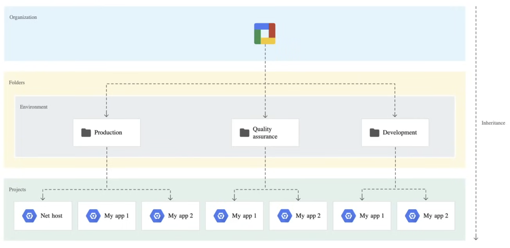

# Terraform Google Cloud Platform Associate Cloud Engineer (GCP-ACE)

The main purpose of this repository is to create resources that are mentioned within [Google Cloud Platform Associate Cloud Engineer](https://cloud.google.com/learn/certification/cloud-engineer) exam. The idea is to deploy and secure applications, services, and infrastructure, monitors operations of multiple projects, and maintains enterprise solutions to ensure target performance metrics are met.

## Development

The projects' GCP identity and resource set up, uses the environment oriented hierarchy, so one organisation contains a folder
per environment and is simple to implement. There are challenges such as deploying shared resources across multiple environments.



### Dependencies

- [gcloud](https://cloud.google.com/sdk/docs/install)
- [terraform](https://www.terraform.io/)
- [terragrunt](https://terragrunt.gruntwork.io/)
- [terraform-docs](https://terraform-docs.io/) this is required for `terraform_docs` hooks
- [pre-commit](https://pre-commit.com/)

## Prerequisites

1. Have a [Google Cloud account](https://cloud.google.com/free) account and [associated credentials](https://cloud.google.com/docs/authentication/provide-credentials-adc#how-to).

## Usage

1. Navigate to the environment you would like to deploy,
2. Initialize the configuration with:

   ```bash
   terragrunt init
   ```

3. Plan your changes with:

   ```bash
   terragrunt plan
   ```

4. If you're happy with the changes

   ```bash
   terragrunt apply
   ```

> [!NOTE]
>
> Please note that terragrunt will create a bucket for storing the remote state. Ensure the account deploying the
> resources has the appropriate permissions to create or connect to these resources.

## Pre-Commit hooks

Git hook scripts are very helpful for identifying simple issues before pushing any changes. Hooks will run on every commit automatically pointing out issues in the code e.g. trailing whitespace.

To help with the maintenance of these hooks, [pre-commit](https://pre-commit.com/) is used, along with [pre-commit-hooks](https://pre-commit.com/#install).

Please following [these instructions](https://pre-commit.com/#install) to install `pre-commit` locally and ensure that you have run `pre-commit install` to install the hooks for this project.

Additionally, once installed, the hooks can be updated to the latest available version with `pre-commit autoupdate`.

## Documentation Generation

Code formatting and documentation for `variables` and `outputs` is generated using [pre-commit-terraform](https://github.com/antonbabenko/pre-commit-terraform/releases) hooks that in turn uses [terraform-docs](https://github.com/terraform-docs/terraform-docs) that will insert/update documentation. The following markers have been added to the `README.md`:

```
<!-- {BEGINNING|END} OF PRE-COMMIT-TERRAFORM DOCS HOOK --->
```

<!-- BEGINNING OF PRE-COMMIT-TERRAFORM DOCS HOOK --->
## Requirements

| Name | Version |
|------|---------|
| <a name="requirement_terraform"></a> [terraform](#requirement\_terraform) | >= 1.5.7, <= 1.9.0 |
| <a name="requirement_google"></a> [google](#requirement\_google) | ~> 7.22.0 |
| <a name="requirement_time"></a> [time](#requirement\_time) | ~> 0.13.1 |

## Providers

| Name | Version |
|------|---------|
| <a name="provider_google"></a> [google](#provider\_google) | 7.22.0 |
| <a name="provider_time"></a> [time](#provider\_time) | 0.13.1 |

## Modules

No modules.

## Resources

| Name | Type |
|------|------|
| [google_folder.environment_folder](https://registry.terraform.io/providers/hashicorp/google/latest/docs/resources/folder) | resource |
| [google_folder_organization_policy.folder_restrict_kms_resource_location](https://registry.terraform.io/providers/hashicorp/google/latest/docs/resources/folder_organization_policy) | resource |
| [google_project.project](https://registry.terraform.io/providers/hashicorp/google/latest/docs/resources/project) | resource |
| [google_project_iam_audit_config.project_audit](https://registry.terraform.io/providers/hashicorp/google/latest/docs/resources/project_iam_audit_config) | resource |
| [google_project_service.project_dependant_services](https://registry.terraform.io/providers/hashicorp/google/latest/docs/resources/project_service) | resource |
| [time_sleep.wait_30_seconds](https://registry.terraform.io/providers/hashicorp/time/latest/docs/resources/sleep) | resource |
| [google_organization.org](https://registry.terraform.io/providers/hashicorp/google/latest/docs/data-sources/organization) | data source |

## Inputs

| Name | Description | Type | Default | Required |
|------|-------------|------|---------|:--------:|
| <a name="input_environment"></a> [environment](#input\_environment) | The environment type e.g. development, staging, production." | `string` | n/a | yes |
| <a name="input_gcp_billing_account"></a> [gcp\_billing\_account](#input\_gcp\_billing\_account) | The alphanumeric ID of the billing account this project belongs to. | `string` | n/a | yes |
| <a name="input_gcp_default_labels"></a> [gcp\_default\_labels](#input\_gcp\_default\_labels) | Labels that will be applied to all resources with a top level labels field or a labels<br/>field nested inside a top level metadata field. | `map(string)` | `{}` | no |
| <a name="input_gcp_project"></a> [gcp\_project](#input\_gcp\_project) | The default project to manage resources in. | `string` | n/a | yes |
| <a name="input_gcp_region"></a> [gcp\_region](#input\_gcp\_region) | The default region to manage resources in. | `string` | n/a | yes |
| <a name="input_gcp_zone"></a> [gcp\_zone](#input\_gcp\_zone) | The default zone to manage resources in. Generally,<br/>this zone should be within the default region you specified. | `string` | n/a | yes |
| <a name="input_organization_domain_name"></a> [organization\_domain\_name](#input\_organization\_domain\_name) | The domain name of the Organization" | `string` | n/a | yes |

## Outputs

| Name | Description |
|------|-------------|
| <a name="output_gcp_project_number"></a> [gcp\_project\_number](#output\_gcp\_project\_number) | The numeric identifier of the project. |
<!-- END OF PRE-COMMIT-TERRAFORM DOCS HOOK --->

# References

[Google Cloud Associate Cloud Engineer Course [2025] - Pass the Exam!](https://youtu.be/OlAmyf8_4O4) - [freeCodeCamp.org](https://www.youtube.com/@freecodecamp)
